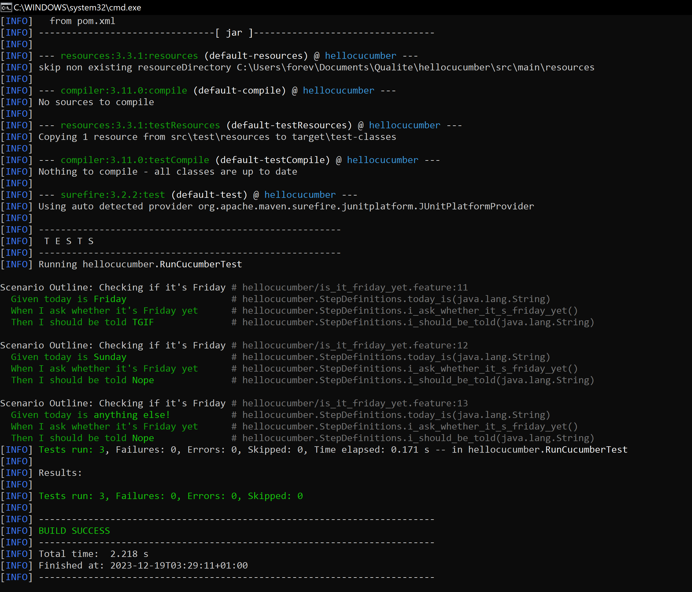
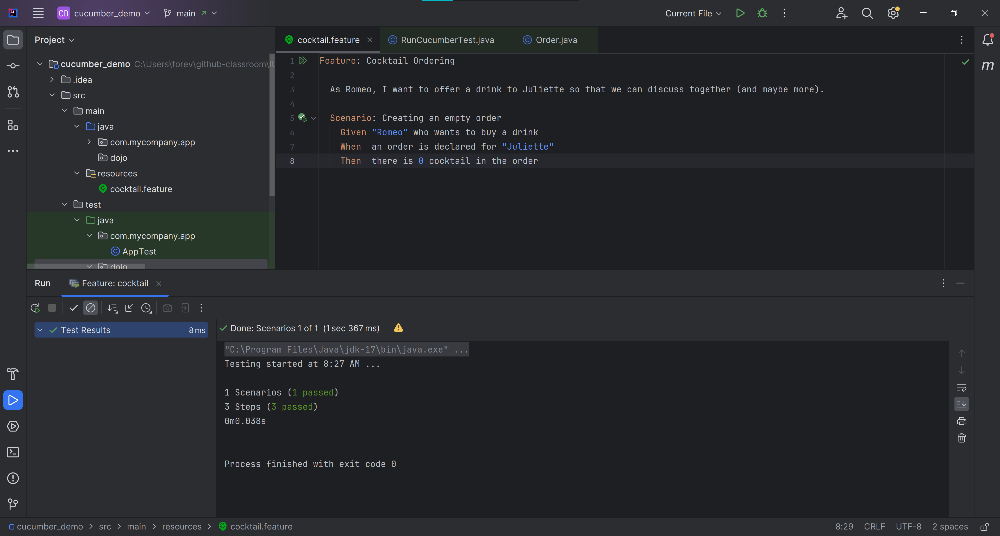

= R5.A.08 -- Dépôt pour les TPs
:icons: font
:MoSCoW: https://fr.wikipedia.org/wiki/M%C3%A9thode_MoSCoW[MoSCoW]

Ce dépôt concerne les rendus de mailto:hai-son.dang@etu.univ-tlse2.fr[Hai Son Dang].

== TP1

.Exemple de code
[source,java]
---
Feature: Is it Friday yet?
  Everybody wants to know when it's Friday

  Scenario Outline: Checking if it's Friday
    Given today is <day>
    When I ask whether it's Friday yet
    Then I should be told <answer>

    Examples:
      | day            | answer |
      | Friday         | TGIF   |
      | Sunday         | Nope   |
      | anything else! | Nope   |
---

.Exemple d'image insérée en asciidoc

== TP2...

.Code de classe Order
[source,java]
---
package dojo;

import java.util.ArrayList;
import java.util.List;

public class Order {
    private String target;
    private String owner;
    private List<String> cocktails;

    public Order() {
        this.cocktails = new ArrayList<String>() {
        };
    }

    public void declareTarget(String t) {
        this.target=t;
    }

    public void declareOwner(String x) {
        this.owner=x;
    }

    public List<String> getCocktails() {
        return this.cocktails;
    }
}

---

.Exemple d'image insérée en asciidoc
